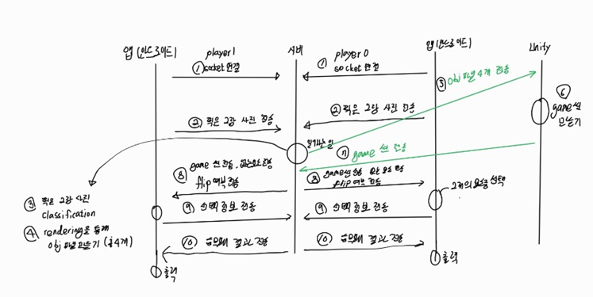

# 개요
이 때는 github를 몰랐을 때라 파일을 github에 저장하지 않았습니다. 
그래서 파일은 아래 drive에 압축으로 올립니다.   
https://drive.google.com/file/d/1XwfenyVAjvisj3-ZBC4GdBZ1MGb7bUCs/view?usp=sharing

이 프로젝트의 개요를 잠시 설명하자면 총 11가지의 과정으로 볼 수 있다. 차근차근 알아보자면 
1. 먼저 서버는 켜져 있는 상태에서 두 대의 안드로이드가 접속 요청을 하고 socket connection이 이루어진다.
2. 안드로이드는 찍은 2장의 사진을 전송한다.
3. 2대의 안드로이드가 찍은 2장의 사진을 전송하면 서버는 multiThread을 이용해서 정보를 따로 따로 받는다. 이 받은 사진을 mediapipe opensource에 각 point의 거리에 따른 정보로 가공하여 이 정보를 학습시켜 classification을 진행한다.  
4. 또한 mano 모델을 이용하여 rendering을 통해 obj파일을 만든다.
5. 총 4개의 obj파일을 unity에 전송한다.
6.unity에서는 받은 obj파일로 game 씬을 만든다. 
7. 게임 씬 이미지를 서버로 전송한다.
8. 서버는 unity에서 받은 게임씬 이미지와 classification으로 각 player별로 없는 요소와 flip 정보(flip 정보는 특별한게 아니라 player0을 기준으로 게임씬이 아래가 player 0 위가 player 1로 구현되기 떄문에 그냥 player0이면 filp하지 않고 player1이면 filp하도록 설계하여 항상 내가 player1이든 player2이든 나에 대한 가위바위보 정보는 아래에 오도록 설계한다.)를 전송한다.
8. 안드로이드는 전송 받은 정보를 출력하고 2개의 요소중 하나를 선택한다. 
9. 2개의 요소중 선택한 하나를 서버에 전송한다.
10. 서버에서는 player0 와 player1이 준 정보로 승무패를 결정하고 각자 승무패 정보를 (10,11,12 각각 승 무 패) int로 변환해서 android에 전달해준다.
11. 안드로이드는 받은 정보를 출력하는 것으로 마무리한다. 

여기서 나의 역할은 1,2,3,8,9,11이다.
그렇기에 이에 해당하는 kotlin의 파일 부분만 존재한다. 

참고하기 위해서는 개인보고서를 살펴보면 된다.

총 3가지의 역할이 있는데 
1. 서버 구축 및 찍은 사진을 classification 하고 3D rendering 진행
2. 3D rendering 한 파일을 Unity에 동작 시켜서 3차원 입체 scene을 생성하고 서버에 전송함
3. 안드로이드 UI와 서버 통신 담당

여기서 나의 역할은 3번이었다. 

최종 시연 영상은 아래 링크를 참고하기 바란다.  
https://drive.google.com/file/d/1m_9LZh-p5m_qtkZaIadpo_ad31xFfsPP/view?usp=sharing
